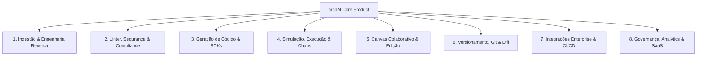

# Plano de Evolução do Produto: As 50 Próximas Features do archM

## Visão Geral e Proposta de Valor Comercial

O **archM** é uma ferramenta de visualização, auditoria e engenharia de arquitetura de software impulsionada por IA. Atualmente, ele converte especificações, coleções e código em diagramas interativos com metadados detalhados por nó (DTOs, rotas, edge cases e falhas).

Para que o **archM** atinja maturidade enterprise, forte diferenciação comercial e alta taxa de adoção pelo mercado, sua evolução deve focá-lo em resolver a maior dor de equipes de engenharia: **o abismo entre a documentação de arquitetura (que fica desatualizada) e o código real em execução (drift de arquitetura, falhas de segurança e falta de governança)**.

Este plano organiza as **50 próximas features** estruturadas em **8 pilares estratégicos**, cobrindo engenharia reversa, governança, simulação de falhas, geração de código, colaboração multiplayer e integrações enterprise.

---

## User Review Required

> [!IMPORTANT]
> **Definição de Priorização e MVP da Fase 1**: Recomendamos iniciar o desenvolvimento focado nos Pilares 1 (Ingestão & Engenharia Reversa de Repositórios) e 2 (Linter & Auditoria de Segurança), pois esses 2 pilares trazem o efeito "WOW" imediato para CTOs e Tech Leads.

> [!NOTE]
> As 50 features foram mapeadas considerando cenários de precificação SaaS (tiers Free, Pro, Team e Enterprise), suporte on-premise e extensões de CI/CD.

---

## Estrutura das 50 Features por Pilar Estratégico

---

### Pilar 1: Ingestão de Código & Engenharia Reversa Automática (Deep Ingestion)
*Objetivo: Eliminar a necessidade de copiar/colar texto ou criar diagramas manualmente.*

1. **GitHub/GitLab Repository Scanner & Direct Sync**: Conectar repositórios Git via OAuth/App para varrer o código-fonte e autogerar/atualizar a arquitetura continuamente.
2. **Analisador AST Multi-Linguagem**: Análise estática profunda para Java (Spring Boot), C# (.NET), TypeScript (NestJS/Express), Python (FastAPI) e Go para extrair rotas, controllers, serviços e injeção de dependência.
3. **Importador de Infraestrutura como Código (IaC)**: Importação nativa de Terraform (`.tf`), AWS CloudFormation, Helm Charts e manifestos de Kubernetes (`k8s.yaml`) para mapear a topologia cloud.
4. **Parser NATIVO de GraphQL & Protobuf (gRPC)**: Leitura e renderização automática de schemas `.graphql` e arquivos `.proto` com suporte a RPCs, queries, mutations e tipos.
5. **Importador de Schemas SQL & ORM Models**: Importação de scripts DDL SQL, Prisma Schemas e modelos Entity Framework/TypeORM para gerar diagramas de fluxo de dados e ERD.
6. **AsyncAPI & Event Mesh Importer**: Suporte a especificações AsyncAPI, tópicos Kafka, filas RabbitMQ e AWS EventBridge para mapear arquiteturas orientadas a eventos.
7. **Detecção Automática de Monorepos & Microserviços**: Leitura de estruturas Nx, Turborepo ou repositórios múltiplos para identificar fronteiras de serviços e chamadas HTTP/gRPC internas.

---

### Pilar 2: Motor de Architectural Linting, Segurança & Qualidade
*Objetivo: Fazer o archM auditar e apontar falhas de arquitetura antes de ir para produção.*

8. **Linter Arquitetural em Tempo Real**: Detecção automática de anti-patterns (ex: Acoplamento Circular entre serviços, God Services, Monólito Distribuído e Banco de Dados compartilhado).
9. **Auditor de Segurança OWASP & Vulnerabilidades Cloud**: Identificação visual de endpoints sem autenticação/autorização, DTOs expondo PII sem criptografia e falta de sanitização.
10. **Inspector de Resiliência & Fault Tolerance**: Verificação automática de ausência de Circuit Breakers, Retentativas (Retries com Exponential Backoff), Dead Letter Queues (DLQ) e Timeouts.
11. **FinOps & Estimador de Custo de Cloud**: Estimativa de custo mensal de infraestrutura (AWS/GCP/Azure) com base na topologia desenhada e volume estimado de requisições.
12. **Simulador de SLA, Latência & Gargalos (P95/P99)**: Cálculo de latência ponta a ponta e destaque visual do "caminho crítico" (gargalo de performance).
13. **Guardrails de Compliance & Privacidade (GDPR / LGPD / PCI-DSS)**: Alertas visuais para tráfego não criptografado de dados sensíveis ou armazenamento inadequado de dados bancários/pessoais.
14. **Regras de Arquitetura Customizadas (Policy-as-Code via OPA/Rego)**: Permite que Tech Leads definam regras corporativas customizadas (ex: "Todo serviço POST deve passar pelo API Gateway").

---

### Pilar 3: Geração de Código, Boilerplate & Exportação de SDKs
*Objetivo: Transformar o diagrama validado em código funcional pronto para produção.*

15. **Gerador de Boilerplate Clean Architecture**: Exportação de código backend completo (Controllers, Services, DTOs, Repositórios e Testes) em TypeScript, C#, Java, Go e Python.
16. **Gerador de SDKs de Cliente & Coleções HTTP**: Exportação de bibliotecas de cliente para consumo das APIs em TypeScript, Swift, Kotlin e coleções prontas do Bruno, Postman e Insomnia.
17. **Gerador de Infraestrutura como Código (IaC Exporter)**: Exportação do diagrama para arquivos Terraform (`.tf`) e `docker-compose.yml` prontos para subida da infraestrutura.
18. **Gerador de Mock Servers & Validade de Contratos**: Criação de servidores mock instantâneos (MSW / Prism / WireMock) para testes de integração frontend/backend sem dependência de ambiente.
19. **Auto-Gerador de Architecture Decision Records (ADRs)**: Geração de documentos Markdown no padrão Nygard registrando decisões técnicas, trade-offs e alternativas descartadas.
20. **Exportador de Portal de Documentação Interativo**: Exportação de site de documentação estático (HTML/MDX estilo Redoc/Mintlify) com diagramas interativos e testador de API integrado.

---

### Pilar 4: Simulação Interativa, Execução & Chaos Engineering
*Objetivo: Testar o comportamento da arquitetura sob estresse e falhas.*

21. **Simulador de Fluxo de Requisição Passo a Passo**: Animação interativa do caminho percorrido por uma requisição, mostrando transformações do payload, códigos HTTP e alterações no banco.
22. **Simulador de Chaos Engineering & Injeção de Falhas**: Simulação visual de queda de nós (ex: Redis offline, DB timeout, Auth service 503) e observação de falhas em cascata.
23. **Visualizador de Carga & Distribuição de Tráfego**: Heatmap sobre o canvas indicando Throughput (RPS), uso de CPU e IOPS nos nós durante picos de acesso.
24. **Integração com Telemetria e Traces Reais (OpenTelemetry / Jaeger)**: Importação de Trace IDs de produção para destacar no diagrama o caminho real percorrido por uma chamada de usuário.
25. **Visualizador de State Machines & Saga Pattern**: Modo canvas dedicado para orquestração de transações distribuídas, compensações e transição de estados.
26. **Gerador de Scripts de Teste de Carga (K6 / Locust / Artillery)**: Exportação de scripts de teste de estresse configurados automaticamente com URLs, DTOs e níveis de concorrência.

---

### Pilar 5: Canvas Colaborativo, Multiplayer & Edição Visual Avançada
*Objetivo: Oferecer a melhor experiência de design visual e co-criação em tempo real.*

27. **Colaboração Multiplayer em Tempo Real**: Edição síncrona estilo Figma com múltiplos cursores, presença de usuários e chat integrados via WebSockets / CRDTs.
28. **Edição Bidirecional 2-Way Sync (Drag & Drop <-> Código Mermaid)**: Alterações visuais no canvas atualizam instantaneamente o código Mermaid/ReactFlow e vice-versa.
29. **Motor de Auto-Layout Inteligente por Camadas**: Algoritmos (Dagre / ELK) que organizam automaticamente diagramas complexos nas camadas Presentation, Application, Domain, Data e Infra.
30. **Biblioteca de Templates & Blueprints de Arquitetura**: Catálogo de arquiteturas prontas (ex: CQRS + Event Sourcing, Micro-frontends, RAG Pipeline Serverless, OAuth2 PKCE Flow).
31. **Design System & Ícones de Cloud (AWS, Azure, GCP, K8s, CNCF)**: Suporte nativo ao conjunto oficial de ícones das principais nuvens e tecnologias de mercado.
32. **Anotações, Sticky Notes & Threads de Comentários por Nó**: Possibilidade de abrir threads de discussão e code review diretamente ancoradas em nós ou conexões.

---

### Pilar 6: Versionamento, Governança & Motor de Diferenças (Diff Engine)
*Objetivo: Garantir que a arquitetura evolua com histórico e rastreabilidade total.*

33. **Motor de Diff Visual de Arquitetura (A/B Compare)**: Comparação lado a lado entre branches do Git ou versões do diagrama, destacando serviços adicionados, removidos e alterações em DTOs.
34. **Sistema de Versionamento Interno & Tagging**: Registro de histórico de alterações com suporte a tags de versão (ex: `v1.2.0-arch`) e pontos de restauração.
35. **Detecção de Architectural Drift (Projeto vs Realidade)**: Comparação contínua do diagrama aprovado contra o código do repositório/telemetria para alertar rotas não documentadas ou serviços "zumbis".
36. **Workflow de Aprovação e Sign-off de Arquitetura**: Modo de revisão corporativa com botões "Aprovar", "Solicitar Mudanças" e carimbo de aceite por Principal Architects.
37. **Trilha de Auditoria & Activity Log**: Registro completo de auditoria para conformidade enterprise, listando quem alterou nós, exportou dados ou executou verificações.

---

### Pilar 7: Integrações Enterprise & Pipeline CI/CD
*Objetivo: Integrar o archM nativamente no fluxo de trabalho diário das equipes de dev.*

38. **Plugin de Pipeline CI/CD (GitHub Actions / GitLab CI)**: Execução automatizada de linter de arquitetura e geração de prévia gráfica do diagrama nos Pull Requests.
39. **Plugin para Confluence, Notion & Backstage**: Embed dinâmico e interativo de diagramas do archM em portais internos de desenvolvedores.
40. **Integração com Jira & Linear para Criação de Tasks**: Geração automática de tarefas/estórias no Jira ou Linear a partir de edge cases ou falhas identificadas nos nós.
41. **Single Sign-On (SSO) & RBAC Corporativo**: Autenticação SAML 2.0 / OIDC (Okta, Azure AD, Auth0) e controle de acesso baseado em papéis (Viewer, Editor, Architect, Admin).
42. **Implantação Self-Hosted / On-Premise (Docker & Kubernetes)**: Suporte a deploy em infraestrutura própria sem tráfego de dados para fora da rede corporativa.
43. **Provedores de LLM Customizados (Bring Your Own Key / Local LLMs)**: Suporte a modelos locais via Ollama/vLLM ou chaves privadas Azure OpenAI / Anthropic Claude para privacidade total.

---

### Pilar 8: Inteligência de Negócio, Métricas & Monetização SaaS
*Objetivo: Gerar métricas de saúde técnica e dar suporte ao modelo de negócios.*

44. **Scorecard de Saúde & Débito Técnico da Arquitetura**: Dashboard com nota consolidada (0 a 100) medindo Saúde Arquitetural, Índice de Segurança, Resiliência a Falhas e Cobertura de Testes.
45. **Matriz de Propriedade & CODEOWNERS por Componente**: Mapeamento de responsáveis (Domain Owners / Squads) por serviço ou nó do diagrama.
46. **Co-Piloto de Arquitetura por Chat (AI Architect Assistant)**: Assistente de IA contextual que responde perguntas sobre o diagrama ("O que acontece se o Redis cair?", "Refatore este trecho para Serverless").
47. **Mapeamento de Bounded Contexts (Domain-Driven Design - DDD)**: Ferramentas visuais para delimitar Bounded Contexts, agregados e dicionário de linguagem ubíqua.
48. **Exportação de Apresentações em Alta Resolução**: Exportação vetorial em SVG, PDF executivo e geração automática de slides (PowerPoint/Google Slides) para diretoria/C-level.
49. **Visualizador Público Embedável & Links Protegidos**: Geração de links somente leitura com senha, expiração temporal e controle de visualização.
50. **Gestão Multi-Tenant & Quotas de Uso**: Painel administrativo para empresas gerenciarem múltiplos workspaces, squads, cobrança por assento/uso e limites de tokens de IA.

---

## Plano de Verificação e Validação

### Cobertura de Verificação
- **Validação de Viabilidade Técnica**: Testar parsers de OpenAPI, AsyncAPI e AST em repositórios de exemplo.
- **Validação Comercial & Aceitação**: Apresentar os 8 pilares para Tech Leads e Arquitetos para priorização das Fases 1 a 3 no backlog.
- **Testes de Integração**: Garantir que as alterações no canvas ReactFlow/Mermaid preservam metadados sem perda de contexto nos nós.
